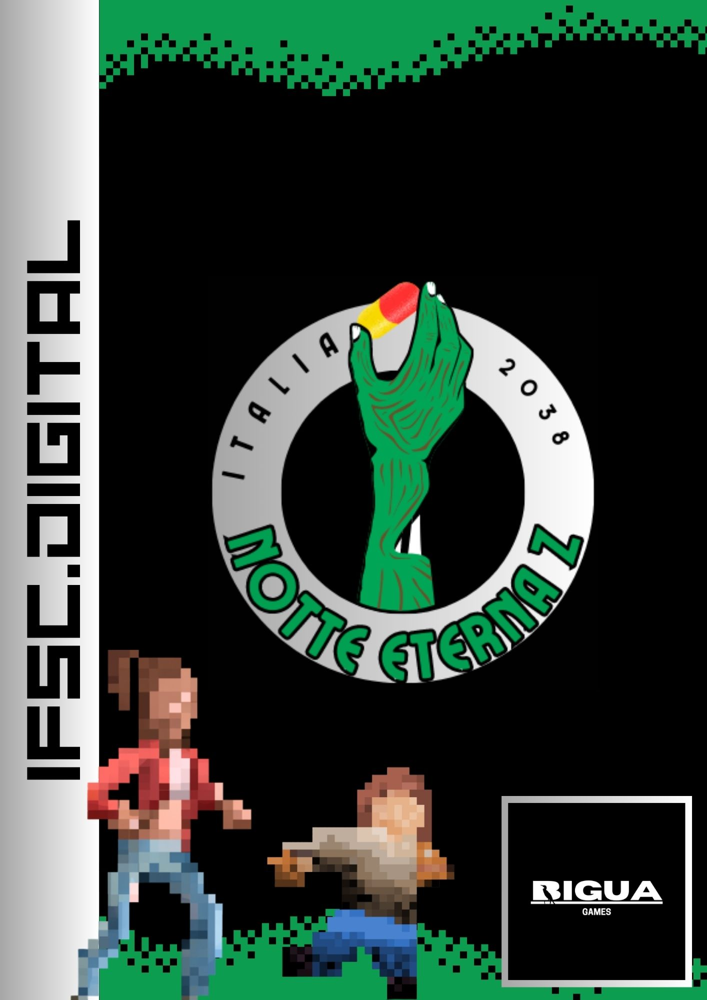

# Notte Eterna Z

Premissa: O enredo deste jogo se desenrola em um futuro próximo, onde uma pandemia global causada por um vírus transforma seus portadores em criaturas desconhecidas na sociedade. Os protagonistas da história são Ginevra, uma ex-agente especial do serviço secreto italiano, e Francesco, um jovem garoto que se descobre infectado após ter seu acampamento atacado por uma horda de infectados. A missão da dupla é chegar a uma base militar, onde a cura para a infecção de Francesco está localizada. Durante a jornada, Ginevra deve proteger o garoto de diversos perigos e obstáculos que encontrarem pelo caminho.

Referências: O jogo será um platformer game, de 2 jogadores em um apocalipse zumbi, as referẽncias são: 
fireboy and watergirl; 
adventure pals; 
rocketbirds 2: evolution; 
cuphead; 
limbo;
spelunky 2;
hollow knight; 
the last of us;
the walking dead; 

Jogo Ideal: O jogo é um plataforma 2D para dois jogadores, combinando elementos de shooter, puzzle e comunicação por voz (VOIP). Situado em um cenário pós-apocalíptico, os jogadores assumem o controle de Ginevra, uma ex-agente especial do serviço secreto italiano de 33 anos. O segundo personagem jogável é Francesco, um órfão de 11 anos infectado pelo Vírus Vlad, que tem apenas 24 horas de vida. No entanto, ao longo do jogo, é possível encontrar medicamentos que permitem que ele evite a transformação em zumbi e alcance a base militar mais próxima com sua líder de acampamento, onde a cura está disponível.
Em 2025, os laboratórios BranTech, localizados na Romênia, estavam à procura de um meio de melhorar as habilidades humanas por meio do super desenvolvimento do cérebro. No entanto, esse projeto deu errado e acabou originando o Vírus Vlad, que anos depois passou a ser chamado de V-Vírus, afetando diretamente a parte posterior do córtex cerebral. Em 2038, a população humana foi quase totalmente erradicada, e aqueles que sobreviveram buscam lugares para sobreviver, criando diversas comunidades e acampamentos. Os inimigos são seres humanos transformados em zumbis, que não possuem consciência e apenas buscam infectar aqueles que atravessam o caminho deles.

Regras: Cada jogador controla um personagem. Eles podem se mover para a esquerda e direita, saltar. Os jogadores precisam trabalhar juntos para sobreviver.
Para passar de fase é necessário pegar o medicamento, e depois as chaves.

Objetivo: O objetivo do jogo é proporcionar ao jogador um entretenimento envolvente, dentro do cenário de uma história. Para atingir esse objetivo, é necessário que o jogador consiga passar o tempo dentro do jogo, mergulhando na narrativa e desafiando-se com as mecânicas de jogo. 

Receita: A receita gerada pelo jogo tem como base inicial a exibição de anúncios. Ou seja, ao jogar, o usuário será exposto a publicidade que contribuirá para a geração de receita do jogo.

